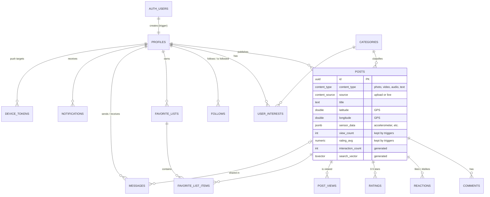

# UPlants – database (Supabase)

`database.sql` is the schema exported from Supabase, kept for reference only (it isn't runnable).
`migrations/` holds the changes that make it ready for the services. Run them in order.

## Data model



Counters on `posts` (likes, comments, views, shares, ratings) are updated by triggers, so feeds can be sorted without heavy queries.

## How it meets the assignment

| Requirement | Where in the database |
|---|---|
| Registered users and visitors | `auth.users` + `profiles`; visitors read through the services without an account |
| View and search content | `posts.search_vector` (full-text on title, description, species) + `tags` |
| View and search users | `profiles` with partial-match indexes on `username` / `display_name` |
| Every user has a profile (username, description, contents) | Created on sign-up by a trigger: `username`, `bio`, posts via `author_id` |
| Content categorised / organised by type | `posts.content_type` (photo, video, audio, text) + `category_id` → `categories` |
| Ranking for visitors (ratings, views, interactions) | `rating_avg`, `view_count`, `interaction_count` (indexed) |
| Personalised feed for registered users | `user_interests` (categories) + `follows` |
| Publish content | `posts`, files in Storage bucket `post-media` |
| Comment | `comments` |
| Rate (0–5 stars, likes/dislikes) | `ratings.stars` (0–5), `reactions.value` (+1 / −1) |
| Favourite lists with custom names | `favorite_lists.name` + `favorite_list_items` |
| Share with other users | `messages.shared_post_id` (+ `share_count`) |
| Local data or live recording | `posts.source` = `upload` / `live` |
| Device hardware (GPS, sensors, camera) | `latitude`, `longitude`, `location_name`, `sensor_data`, `media_url` |
| Sort by date, rating, interactions | `created_at`, `rating_avg`, `interaction_count` (indexed) |
| History + statistics dashboard | `posts` by author; `post_views.viewed_at` (views over time); `ratings` grouped by `stars` (histogram) |
| Social tools (follow, like, message) | `follows`, `reactions`, `messages` |
| Notifications | `notifications` (`new_post`, `comment`, `like`, `rating`, `follow`, `message`, `share`) + `device_tokens` for push |
| Offline content *(optional)* | Not in the database: cached in the app |

## Proposed ownership by service

> **Not done yet:** the microservices haven't been built. This is the planned split and may change as they are created.

Each microservice owns its tables and is the only one that writes to them:

```
users-service          profiles, follows, user_interests
content-service        posts, categories, Storage buckets
interactions-service   comments, reactions, ratings, post_views
favorites-service      favorite_lists, favorite_list_items
messaging-service      messages
notifications-service  notifications, device_tokens
```

## Applying the migrations

Supabase dashboard → **SQL Editor** → paste each file, in order → **Run**:

| File | What it does |
|---|---|
| `001_constraints_and_indexes.sql` | `ON DELETE CASCADE` / `SET NULL` on every foreign key, no self-follow / self-message, case-insensitive unique usernames, search & feed indexes, auto `updated_at` |
| `002_auth_profiles.sql` | Sign-up creates the `profiles` row automatically; `email_for_username()` lets the users-service log in by username |
| `003_post_counters.sql` | Triggers keep `like_count`, `dislike_count`, `comment_count`, `view_count`, `share_count`, `rating_count`, `rating_avg` in sync |
| `004_row_level_security.sql` | Turns RLS on with no policies, so the public API exposes nothing and only the services can read/write |
| `005_storage_buckets.sql` | Public buckets `avatars` (5 MB, images) and `post-media` (50 MB, image/video/audio) |
| `006_seed_categories.sql` | Starting plant categories |

Every file is safe to run again. If one fails, fix the cause and re-run that file.

## Dashboard settings

- **Authentication → Sign In / Providers → Email → "Confirm email": off** while developing.
  When it's on, sign-up returns no session until the user clicks the email link, and the app expects to be logged in right after registering.

## Keys: who gets what

The app talks **only** to our microservices. The services talk to Supabase.

| Value | Where to find it | Who uses it |
|---|---|---|
| Project URL | Project Settings → Data API | services |
| Publishable key (`sb_publishable_…`, legacy name *anon*) | Project Settings → API Keys | users-service (Auth sign-up / log-in calls) |
| Secret key (`sb_secret_…`, legacy name *service_role*) | Project Settings → API Keys | services: full access, bypasses RLS |
| Connection string | **Connect** button (top bar) → **Session pooler** | services that use SQL directly |

Copy `../.env.example` to `../.env` and fill it in. `.env` is git-ignored: **never commit it, and never put the secret key or DB password in the Android app.**
Share the real values with teammates privately (not in the repo or a group chat screenshot).

Use the *Session pooler* connection string, not *Direct connection*: the direct one is IPv6-only on the free plan and often won't connect from home networks or Docker.

## Using it from a service

**Sign up** (users-service):
```http
POST {SUPABASE_URL}/auth/v1/signup
apikey: {SUPABASE_PUBLISHABLE_KEY}
Content-Type: application/json

{ "email": "ana@example.com", "password": "…", "data": { "username": "ana", "display_name": "Ana" } }
```
The `profiles` row is created by the trigger. Check the username is free first (`profiles`, case-insensitive), otherwise Supabase only answers *"Database error saving new user"*.

**Log in by username**: `select public.email_for_username('ana')` (secret key / SQL connection only), then
`POST {SUPABASE_URL}/auth/v1/token?grant_type=password` with `{ "email", "password" }`.

**Verify a user on later requests**: the app sends the `access_token` it got at login; the service checks it with
`GET {SUPABASE_URL}/auth/v1/user` (`Authorization: Bearer <token>`) or by verifying the JWT locally.

**Counters are automatic**: insert/delete rows in `reactions`, `ratings`, `comments`, `post_views`, or `messages` (with `shared_post_id`)
and the numbers on `posts` update. Never write those columns directly.
